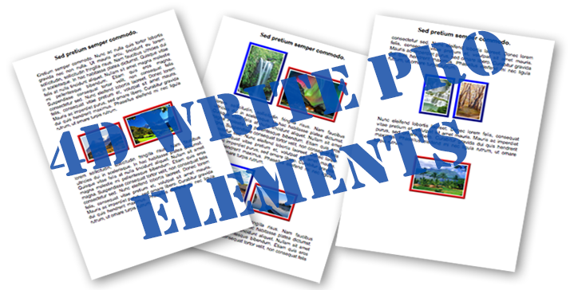

# HDI_4DWP_Elements

  

**How do I use the 4D Write Pro "table range" and "element collections"?**

A 4D *How Do I* (HDI) example that shows how to programmatically access and style the elements of a 4D Write Pro document: tables, rows, cells, paragraphs, pictures, headers, footers and anything with an ID.

## Requirements

| | |
|---|---|
| 4D version | 4D 21 or later (project compatibility version 21.1). The splash form itself checks for 16 R6+. |
| License | 4D Write Pro (the splash form shows a notice and offers to return to design mode when it is missing). |
| Platforms | macOS and Windows. Dark mode and macOS Liquid Glass are supported. |

## Quick start

1. Open `Project/HDI_4DWP_Elements.4DProject` with 4D.
2. Run the project. `onStartup` calls `00_Start`, which opens the splash form and then the demo form.
3. The first run imports the sample pages from `Resources/INFO.4ie` / `INFO.4si` into the `INFO` table.
4. Pick a tab, read the description on the left and try the buttons under the Write Pro area on the right.

## What the demo covers

Each tab of the `HDI2` form illustrates one technique.

| Tab | Technique | Key commands |
|---|---|---|
| Table range | Get a range covering a table, then style it in one call | `WP Table range`, `WP SET ATTRIBUTES` |
| Get elements | List all elements, or only tables, paragraphs or pictures | `WP Get elements`, `wk type table`, `wk type paragraph`, `wk type image` |
| Colorize tables | Style tables, rows and cells (header, footer, alternating rows) | `WP Get elements`, `WP Table get cells` |
| Paragraphs | Alternate paragraph styling in the body | `WP Get body`, `WP RESET ATTRIBUTES` |
| Images | Frame pictures differently by orientation | `WP Get attributes`, `PICTURE PROPERTIES` |
| Header and footer | Style paragraphs in a section's header and footer | `WP Get header`, `WP Get footer` |
| Element by ID | Pick an element by its ID and set its border | `WP Get element by ID` |

The table form `INFO` (`Input` / `Output`) is the authoring side: it edits the page texts and the Write Pro sample for each tab, and demonstrates `WP Insert table`, `WP Table append row` and `WP Insert break`.

## Points of interest

- **Data-driven tabs.** Tab titles, descriptions and sample documents come from the `INFO` table, loaded into arrays in the `HDI2` form method. `HDI_UpdatePage` reloads the sample when the page changes.
- **Element IDs.** Elements can carry an `id`. Setting `$table.id` and selecting by it (`WP Get element by ID`) is the stable way to target an element.
- **Reusable splash.** The `HDI` form takes an object (`title`, `info`, `blog`, `minimumVersion`, `license`) and checks version and license on load. Copy it to other HDI projects and change the options in `00_Start`.
- **Non-blocking windows.** `00_Start` calls itself through `CALL WORKER` and opens windows with `DIALOG(...; *)`. Reopening **File > Demo** brings the existing window to the front.
- **Standard actions.** The Quit and Edit menu items use standard actions, so they integrate with each platform's menu conventions.
- **Localisation.** All UI text is in XLIFF (`Resources/en.lproj`, `Resources/ja.lproj`). Forms use `:xliff:` references, methods use `Localized string`. The sample page texts in the `INFO` data are English only.
- **Appearance.** `styleSheets.css` defines light and dark variants and forms use `"automatic"` colors. `styleSheets_mac.css` sizes buttons by theme (27 px for `liquid-glass`, 23 px for `mac-classic`) through the `default` class.
- **Typed code.** Methods use `var` and `#DECLARE`. The project has no `C_*` declarations.

## Project layout

```
Project/Sources/
  Methods/            00_Start (entry point), HDI_UpdatePage, ReadWrite, Compiler_*
  Forms/HDI           splash form
  Forms/HDI2          demo form, one object method per button
  TableForms/1        Input / Output forms of the INFO table
  menus.json          menu bar (standard actions)
  styleSheets*.css    shared, macOS and Windows styles
Resources/
  en.lproj, ja.lproj  XLIFF files (menu, per-form, messages)
  INFO.4ie, INFO.4si  sample data imported on first run
  Images/             splash background
```

## Origin

This project started as a v17 binary `.4DB` example database distributed with 4D. It was converted to the project architecture (`.4DProject`) with the binary-to-project conversion in 4D 21, then modernised with the help of **GitHub Copilot**.

- **Blog post:** https://blog.4d.com/programmatically-access-elements-in-4d-write-pro/
- **Original download:** https://downloads.4d.com/Demos/4D_v17/HDI_4DWP_Elements.zip

## References

- [4D Write Pro](https://developer.4d.com/docs/WritePro/overview)
- [`WP Get elements`](https://developer.4d.com/docs/WritePro/commands/wp-get-elements)
- [`WP Table range`](https://developer.4d.com/docs/WritePro/commands/wp-table-range)
- [`WP SET ATTRIBUTES`](https://developer.4d.com/docs/WritePro/commands/wp-set-attributes)
- [CSS in 4D forms](https://developer.4d.com/docs/FormEditor/stylesheets)
- [XLIFF architecture](https://developer.4d.com/docs/Project/xliff)
- [`CALL WORKER`](https://developer.4d.com/docs/commands/call-worker) and [`DIALOG`](https://developer.4d.com/docs/commands/dialog)

## Screenshots


